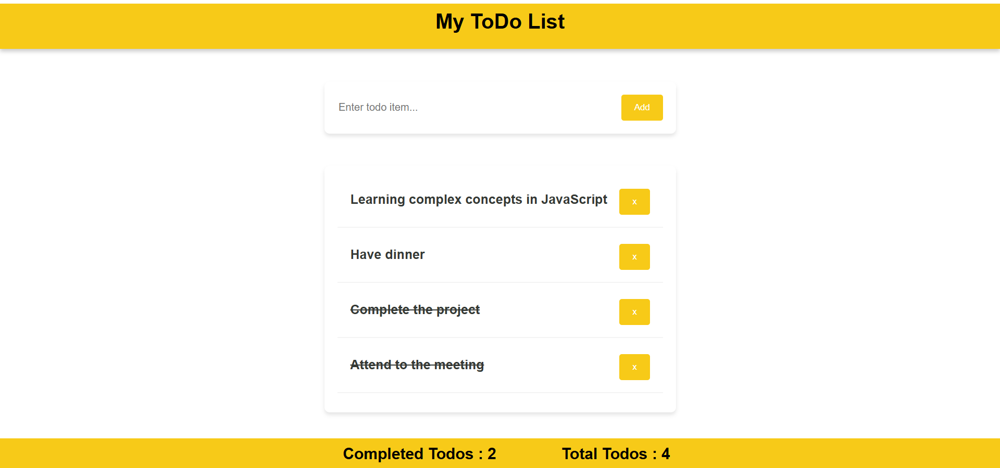

# ToDoApp

A simple, intuitive To-Do List web app built with HTML, CSS and JavaScript.

##  Table of Contents

- [About](#about)  
- [Features](#features)  
- [Screenshot](#screenshot)  
- [Getting Started](#getting-started)  
  - [Prerequisites](#prerequisites)  
  - [Installation](#installation)  
- [Usage](#usage)  
- [Project Structure](#project-structure)  
- [Technologies](#technologies)  
- [Future Improvements](#future-improvements)  

## About

This project provides a lightweight ToDo app where users can add tasks, mark them as completed, and remove tasks.  
It's designed for simplicity and clarity, perfect as a front-end exercise or a starter project for web development learners.

## Features

- Add new tasks  
- Mark tasks as completed or un-completed  
- Remove tasks  
- Display completed todos count and total todos count seperately

## Screenshot

Here’s a look at the app in action:

  

## Getting Started

### Prerequisites

You’ll just need a modern web browser to run the app locally. Optionally, if you’d like to serve through a local web server, you may install something like `http-server`.

### Installation

1. Clone the repository  
   ```bash
   git clone https://github.com/WaruniGunasena/ToDoApp.git
   cd ToDoApp
````

2. Open `index.html` in your browser
   Or if you prefer using a local web server:

   ```bash
   npx http-server . 
   # then open http://localhost:8080 (or whichever port http-server lists)
````

## Usage

* Type your task into the input field and press **Enter** or click “Add Task”
* Click on the text of a task to mark it as done
* Click the “X” icon/button to delete the task
* The list updates in real time and remains simple and clean

## Project Structure

````
ToDoApp/
│
├─ index.html       # main HTML file  
├─ module.css       # styling using CSS modules for components
|_ Components       # components for the app 
├─ App.js        # JavaScript logic  
├─ screenshots/     # folder containing screenshot images  
└─ README.md        # this file  
````

## Technologies

* HTML
* CSS 
* JavaScript (ES6+)

## Future Improvements

Here are some ideas for enhancing the project:

* Use `localStorage` (or another browser storage) so tasks persist across page reloads
* Add due-dates for tasks and ability to sort/filter by due date or priority
* Implement categories or tags for tasks
* Add edit feature for tasks (change text)
* Improve UI/UX: animations, dark mode, mobile navigation
* Convert to a full-stack app: back-end API and database (e.g., Node.js + Express + MongoDB)
* Add tests for JavaScript logic

**Enjoy building and improving your ToDoApp!**
If you find any bugs or have suggestions, feel free to open an issue.

